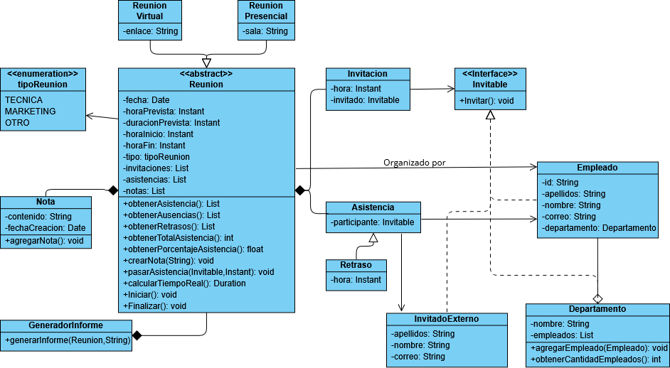

# Tarea2-DOO
Integrantes:
Bastián Cabezas - 2025447711
Laura Mardones - 2025770687
Ricardo Lagos - 2025454386

Cambios al UML:
-Reunion
pasarAsistencia: para poder tener una forma de
llamar a que se guarde la asistencia de un integrante de forma más óptima.
crearNota: para crear las notas se llama a esta función.

-Class GeneradorInforme
Para hacer el código más leíble y sencillo el crear el informe se dejó en una
clase separada.

Class InvitadoExterno:
Para que fuera más fácil distinguir entre los empleados y los no empleados
se creó otra clase con capacidades similares a Empleado sin ser la misma clase.

